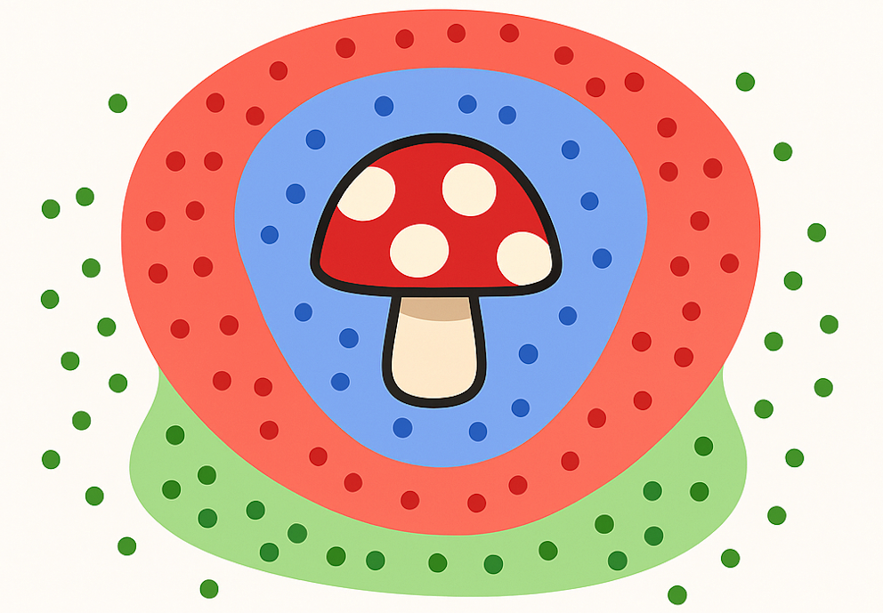

# Neurotical — Neural Networks in the Browser

**Neurotical** is an interactive demo that visualizes how neural networks learn.  
It’s built entirely in the browser using **vanilla JavaScript**, no libraries or frameworks required.

You can train models on simple 2D datasets and the MNIST digit dataset, and explore concepts like gradient descent, hidden layers, and backpropagation.

**Live Demo**: https://neurotical.vercel.app

**YouTube**: https://www.youtube.com/watch?v=ePokoTAbEcY

## Features

- **AI Mycologist** – a fun 2D classifier (safe, poisonous, magical)
- **MNIST Digit Classifier** – image-based digit prediction

## Downloads

- **200 batch training set**: https://storage.googleapis.com/neurotical-mnist/batches.json

---

Inspired by [Sebastian Lague](https://www.youtube.com/watch?v=hfMk-kjRv4c).
